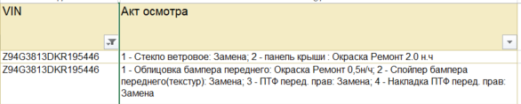

# Служебная программа, выполняющая обработку данных, аналогичную _мульти_-ВПР в MS Excel

## Сферы применения: автобизнес, страхование

 

- Итак, на входе мы имеем регулярно обновляемый отчет от страховой компании (далее - СК), в котором представлена вся 
необходимая информация по страховым событиям (далее - СС), произошедшим с транспортными средствами (далее - ТС) в период
эксплуатации. Уникальным значением (**ключом**) для нас является VIN-номер автомобиля, т.к. в природе не существует двух
совпадающих VIN-номеров. 

- Также мы имеем на входе список VIN-номеров ТС, по которым необходимо забрать из отчета СК все повреждения, полученные
в результате наступления страхового события. При этом в период эксплуатации с ТС могло произойти несколько СС, 
а значит нам необходимо получить повреждения по всем, а также вывести их в MS Excel в следующем формате: 

      На представленном выше скриншоте мы видим машину с двумя СС. В первом столбце VIN-номер ТС, во втором - повреждения по
      первому СС, в третьем - по второму. Если СС больше, повреждения по каждому последующему событию должны выводиться в
      следующий столбец

- Отчет СК, из которого нужно забрать необходимые данные, выглядит следующим образом: 

      На представленном выше скриншоте намеренно продемонстрирована упрощенная структура отчета: скрыто значительное кол-во
      столбцов, содержащих иную инф-цию по СС. При необходимости скрытые данные также можно использовать, незначительно
      поправив код

 
Таким образом мы видим, что обычный ВПР не выполнит поставленную задачу, т.к. способен возвращать только одно значение
из диапазона, в котором выполняется поиск. То есть в данном случае для VIN-номера из примера мы бы смогли найти только
то СС, где в акте осмотра указано: "1 - Стекло ветровое..."

Без использования Python задачу можно решить и в MS Excel, используя формулу массива и создав готовый файл с "зашитыми" 
в него формулами (https://www.youtube.com/watch?v=_NEvWYp33Eg), однако это не лучшее решение для большого объема данных.
Например, если проверить необходимо несколько тысяч (а иногда и сотен) VIN-номеров в "один заход", Excel просто 
перестанет отвечать или будет обрабатывать данные неоправданно долго.

## Краткое описание работы программы:

1. VIN-номера ТС, по которым необходимо получить повреждения, копируются в файл vins_for_checking.txt. После 
этого файл необходимо сохранить и закрыть.
2. Далее необходимо открыть файл Все_убытки.xls и на панели быстрого доступа выполнить макрос с обозначением 

       Макрос делает следующее:
       - открывает отчет СК;
       - копирует оттуда все VIN-номера и соответствующие им повреждения;
       - вставляет эти данные в файл Все_убытки.xls;
       - снова копирует данные;
       - закрывает отчет СК;
       - Создает файл all_damages.txt и вставляет туда скопированные данные; 
       - удаляет данные в файле Все_убытки.xls
3. Затем в этом же файле (см. комментарий ниже) по нажатию на  выполняется код 
(что происходит в коде, см. в комментариях в файле main.py). 

       При этом важно отметить, что код не нужно выполнять ни в консоли, ни в IDE, т.к. для его выполнения на любом
       компьютере, где не установлен Python или IDE, создано специальное .exe-приложение (Code.exe). 
       Для выполнения Code.exe создан отдельный макрос, который вызывается прямо в Excel

4. После выполнения кода необходимо вызвать третий макрос по нажатию на 

       Данный макрос выводит в Все_убытки.xls искомые данные из текстового файла, в который программа записывает результат.  

5. Задача выполнена! Повреждения по всем проверяемым VIN-номерам выведены в нужном нам виде и могут использоваться для
дальнейшей обработки заинтересованными сторонами.

6. Не забудьте закрыть файл Все_убытки.xls _без сохранения изменений_, а также удалите проверяемые ВИН-номера из файла
vins_for_checking.txt

_**Таким образом пользователь, решающий задачу, использует только два файла: vins_for_checking.txt, куда копируются 
проверяемые VIN-номера ТС, и Все-убытки.xls, где вся обработка происходит с помощью макросов - в том числе основной бэк,
написанный на Python**_